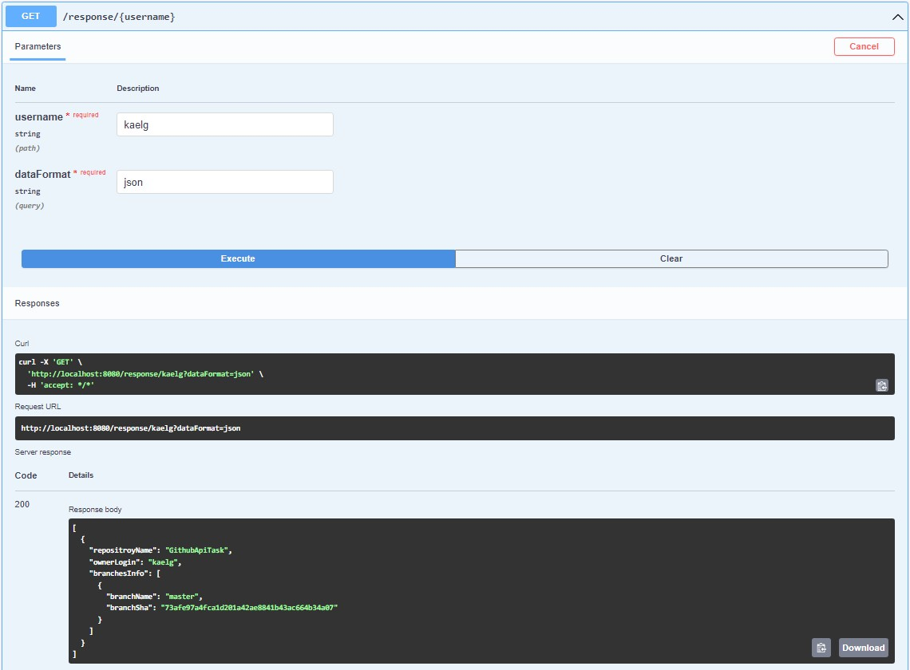

# GithubApiTask
> REST Api to search users repositories which are not forks.

## Technologies Used
- Java - version 17.0
- SpringBoot - version 3.1
- Swagger - version 3.0
- Maven

## Functionality
API has GET endpoint on "/response" which takes username in path variable and data format in parameter. 
Service adding header with given data format (Application:application/{dataformat}). 
Controller return json response with list of repository names, their owners logins and list of branches names and last commit sha. 
When can't find repositories for given username returns 404 error code with message why it happens. 
When given format data is not equal "json" returns 406 error code with message why it happens.
>To see how it works run maven project and go on http://localhost:8080/swagger-ui/index.html#

## Proper usage of endpoint in Swagger

## Contact
Created by [@kaelg] bartekxk@gmail.com - feel free to contact me!
